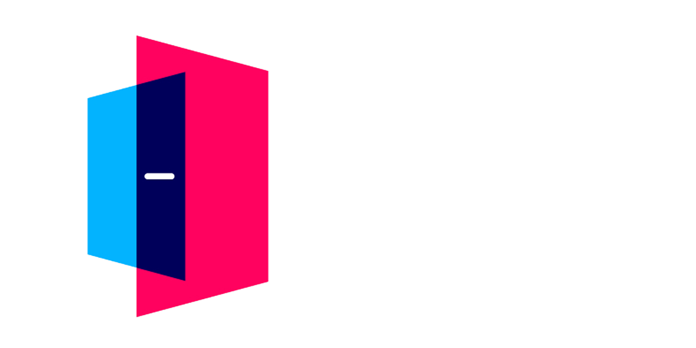

# ClassMate App

# Description
ClassMate is a mobile application designed to help keep parents, students, and the community up-to-date with the latest happenings at school. The app includes the following features:

- Upcoming events
- Important information such as the school calendar and activities schedule
- A photo sharing platform for teachers and students
- A way for parents to notify the school of student absences
- The app is designed to run on both Android and iOS operating systems and can be used on phones and tablets.

# Frameworks & Technologies
ClassMate is built using the Flutter framework, the Dart programming language, and Firebase as the backend.
For video meetings, ClassMate uses the open-source Jitsi Meet SDK.

# Running the App
To run the app, you need to have the Flutter SDK installed on your computer. You can follow the instructions for installation on the Flutter website.

Once you have Flutter installed, follow these steps to run the app:

1. Clone the repository to your local machine:

```shell
$ git clone https://github.com/sbs-app/mobile-app
```

2. Navigate to the root directory of the project:
```shell
$ cd mobile-app
```

3. Run the following command to start the app:
```shell
$ flutter run
```

# Folder layout
- `lib/ui` UI files
- `lib/core` Helper utils for codebase
- `lib/states` Handles BLoC states such as courses and posts
- `lib/models` Models for Users, Courses, and Posts
- `lib/controllers` Controller for auth and courses

# Packages used
- firebase_core: ^2.4.1
- firebase_auth: ^4.2.5
- cloud_firestore: ^4.3.1
- firebase_storage: ^11.0.10
- flutter_bloc: ^7.2.0
- flutter_phoenix: ^1.0.0
- flutter_firebase_chat_core: ^1.6.4
- jitsi_meet: ^4.0.0
- google_fonts: ^3.0.1
- hive: ^2.0.4
- lottie: ^2.2.0
- syncfusion_flutter_calendar: ^20.4.38
- image_picker: ^0.8.6+1

# Licensing & Terms of Use
This app is licensed under the MIT license. By using the app, you agree to the terms of use as outlined in the license.
